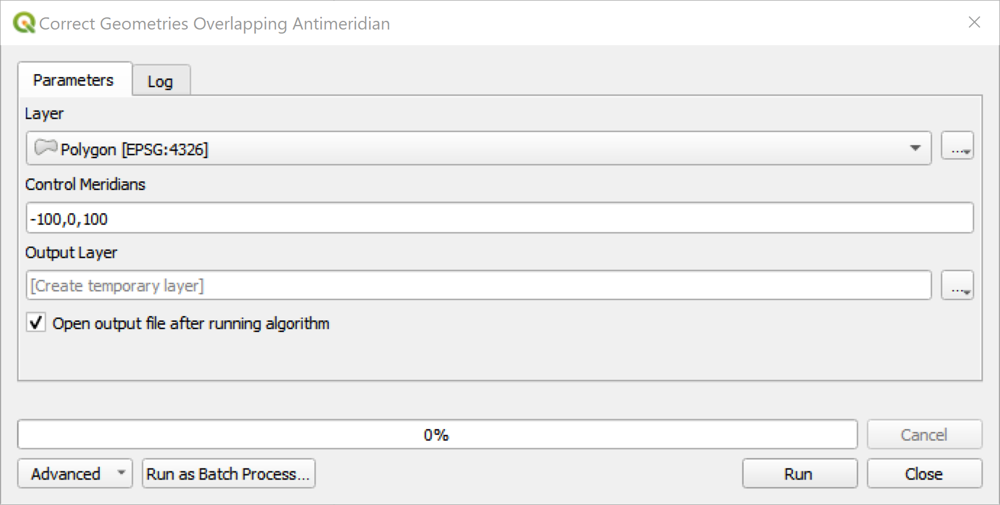

# Correct Geometries Overlapping Antimeridian 

## Introduction

QGIS tool to correct geometries overlapping antimeridian by splitting polygons in order to create multi-polygon.

### Functional Principle

1. "correct" negative x-values of the geometries so it "overflows" the projection's extent, e.g., `-173` will become `187`
2. cut the polygon using a very thin buffer at the longitude `180` using the Difference tool which will create a multi-polygon
3. undo/correct the changes to the geometries (`187` becomes `-173` again) which are overlapping and the multi-polygon has 2 parts on both sides of the map

### Screenshot



### How to use

- Download script file `split_at_antimeridian.py`
- Make sure Shapely is installed (see section *Dependencies*)
- Open *Processing Toolbox* panel (see menu *Processing* and then *Toolbox*)
- Click the dropdown in the panel's toolbar with the Python icon
- Select *Add Script to Toolbox...*, find script file and add it
- You then find the tool at the bottom of the tree under *Scripts*, *Dal Tools* and then *Correct geometries overlapping antimeridian *

### Platform

Tested with QGIS 3.22 on Windows 10

## License

> Copyright (c) 2022 Thomas Zuberbuehler / Dalhousie University
> 
> This program is free software: you can redistribute it and/or modify it under
> the terms of the GNU General Public License as published by the Free Software
> Foundation, either version 3 of the License, or (at your option) any later
> version.
> 
> This program is distributed in the hope that it will be useful, but WITHOUT
> ANY WARRANTY; without even the implied warranty of MERCHANTABILITY or FITNESS
> FOR A PARTICULAR PURPOSE. See the GNU General Public License for more details.
> 
> You should have received a copy of the GNU General Public License along with
> this program. If not, see <http://www.gnu.org/licenses/>.

### Additional Disclaimer

> THE SOFTWARE IS PROVIDED “AS IS”, WITHOUT WARRANTY OF ANY KIND, EXPRESS OR IMPLIED, INCLUDING BUT NOT LIMITED TO THE WARRANTIES OF MERCHANTABILITY, FITNESS FOR A PARTICULAR PURPOSE AND NONINFRINGEMENT.
> 
> IN NO EVENT SHALL THE AUTHORS OR COPYRIGHT HOLDERS BE LIABLE FOR ANY CLAIM, DAMAGES OR OTHER LIABILITY, WHETHER IN AN ACTION OF CONTRACT, TORT OR OTHERWISE, ARISING FROM, OUT OF OR IN CONNECTION WITH THE SOFTWARE OR THE USE OR OTHER DEALINGS IN THE SOFTWARE.

## Dependencies

This tool requires [PyQGIS](https://docs.qgis.org/latest/en/docs/pyqgis_developer_cookbook/index.html) and [Shapely](https://shapely.readthedocs.io/en/stable/manual.html).

### Install `shapely` in QGIS

1. In QGIS, go to *Plugins*, then *Python Console*
2. Then click on the *paper and pen* toolbar icon (Show Editor)
3. Copy/paste following code into the editor
4. Click the green run button in editor's toolbar

```python
import os
import sys
import subprocess

def find_python():

    if sys.platform != "win32":
        return sys.executable

    for path in sys.path:
        assumed_path = os.path.join(path, "python.exe")
        if os.path.isfile(assumed_path):
            return assumed_path

    raise Exception("Python executable not found")

python_exe = find_python()
subprocess.check_call([python_exe, "-m", "pip", "install", "shapely"])
```

**Note:** Installing an additional Python package with QGIS can be tricky. It's always recommended having a backup before doing so.

## Resources and Relevant links

- https://gist.github.com/moosetraveller/6e1a117ee86c0df5f4c53bc6cc920d97
- https://gis.stackexchange.com/questions/396460/qgis-vector-layer-stretched-across-entire-map
